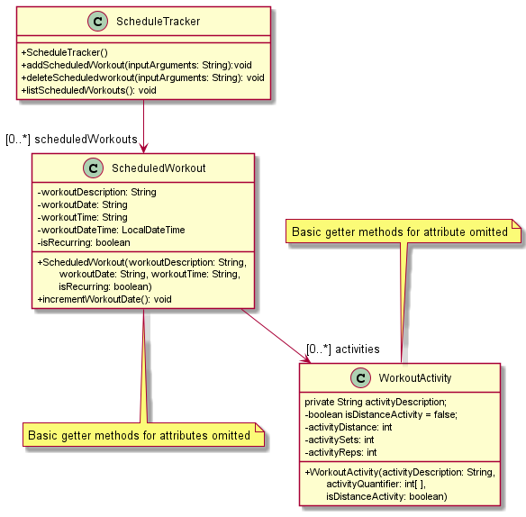
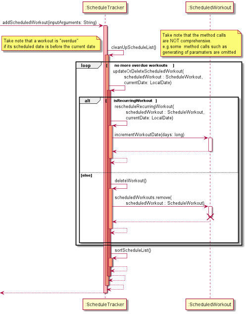

# Developer Guide

## Acknowledgements
The UML Diagrams were generated with the help of: [PlantUML](https://plantuml.com/), ...

{list here sources of all reused/adapted ideas, code, documentation, and third-party libraries -- include links to the original source as well}

## Design & implementation

### ScheduleTracker: Class diagram

Above are the UML class level diagrams of `ScheduleTracker` and `ScheduledWorkout`. As seen in the diagram, one 
`ScheduleTracker` object keeps track/is linked to **any** number of `ScheduledWorkout` objects, thus have a 
multiplicity of `0..*`. This association forms through a private attribute `scheduledWorkouts` which is of type 
`ArrayList<ScheduledWorkout>`. Each `ScheduledWorkout` object also has a private attribute called `activities` which is 
of type `ArrayList<WorkoutActivity>` where `activities` keeps track of **any** number of `WorkoutActivity` objects.
Do note that **not all** class attributes and methods are present in the diagram for 
the sake of better comprehensibility.

#### ScheduleTracker: Adding scheduled workout

The UML sequence diagram above shows what happens when the method `addScheduledWorkout(...)` is called. 
Parameters are generated and a `ScheduledWorkout` object is added into the `scheduledWorkouts` ArrayList.
This is achieved by a few method calls which are omitted from this diagram. The main focus is on `cleanUpScheduleList()`. 
Once called, **if** there are any overdue workouts, a `loop` is entered and calls `updateOrDeleteScheduledWorkout(...)` 
repeatedly until the `loop` condition is satisfied. Essentially, depending on whether the overdue workout detected is 
recurring, the workout is either deleted or rescheduled appropriately. Once the `loop` block exits, `sortScheduleList()` is called and the 
`scheduledWorkouts` is sorted in *ascending* order of `DateTime`

This "updating" is done in any method call that outputs something to the user to ensure a correctly sorted and cleaned up
list is output to the user. This also ensures the `scheduledWorkouts` ArrayList remains free of overdue workouts.

## Product scope
### Target user profile

Useful for people getting into serious fitness routines such as athletes but can be extended to general populace

### Value proposition

CLI.ckFit is a comprehensive workout client with the two main components of a workout diary and a calorie manager 
with the peripherals being weight tracking and BMI/recommended caloric intake calculator. These features can be 
conveniently accessed via the Command Line Interface (CLI).

## User Stories

|Version| As a ... | I want to ... | So that I can ...|
|--------|----------|---------------|------------------|
|v1.0|fitness enthusiast|record my fitness activities|plan my extensive workout schedule|
|v1.0|user|update how many calories I have burned through my workouts|keep track of my daily calories|
|v2.0|user|have the app remember my user data|access my data anytime| 
|v2.0|user|have scheduled workouts in the list to be sorted by the nearest dates|easily keep track of upcoming workouts|
|v2.0|frequent gym goer| be able to schedule recurring weekly workouts| have a routine schedule without having to reschedule the same workout every week|
|v2.0|serious athlete|breakdown my workout into smaller activities|track things like sets, reps and distance|
## Non-Functional Requirements

{Give non-functional requirements}

## Glossary

* *glossary item* - Definition

## Instructions for manual testing

{Give instructions on how to do a manual product testing e.g., how to load sample data to be used for testing}
